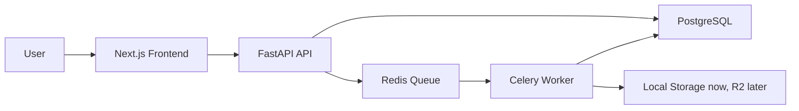

# Sonora Architecture

Sonora is built as a pragmatic MVP monorepo:

## Services

- `frontend/`: Next.js, TypeScript and Tailwind. It handles authentication, media preview, job creation and job history.
- `backend/`: FastAPI API with typed schemas, centralized errors, health checks, auth, media validation and job endpoints.
- `backend/app/worker.py`: Celery worker process for long-running media work.
- `docker-compose.yml`: local production-like runtime with API, worker, Redis, Postgres and frontend.

## Production Notes

- Replace `JWT_SECRET` before any deployed environment.
- Use Cloudflare R2 or S3 signed URLs instead of local `/files` for real user traffic.
- Keep API and worker as separate containers. Heavy ML features should move to dedicated worker images.
- Add Alembic migrations before the first shared staging environment; the MVP uses `create_all` only to move fast locally.
- Add OAuth Google via Supabase, Clerk or Auth.js once product auth requirements are final.
