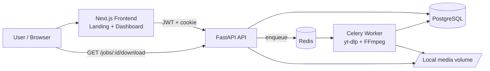
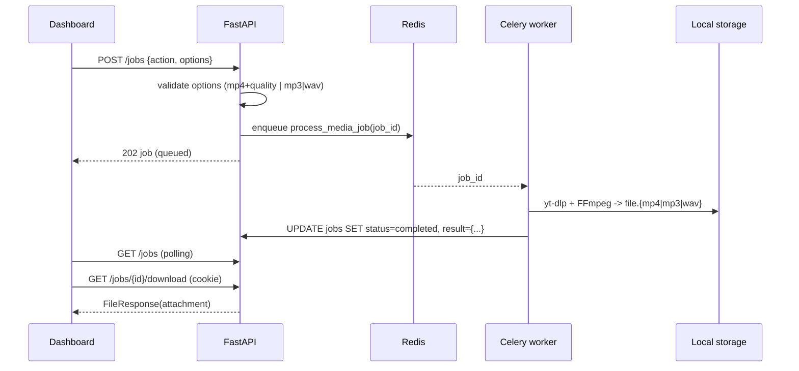

# Sonora Architecture

Sonora is a pragmatic MVP monorepo focused on a single feature: download a YouTube
video or audio track in a clean, authenticated and reliable way.

## Runtime topology

The worker is the only component that writes media files. The API is the only
component that reads them back to the user, and always through an authenticated route
(`GET /jobs/{id}/download`) that sets `Content-Disposition: attachment`.

## Services

- `frontend/`: Next.js 16 + TypeScript + TailwindCSS. One root component
  (`SonoraApp`) picks between two views:
  - `Landing`: short hero + Login / Create account card.
  - `Dashboard`: URL input, Preview, Video/Audio selector, resolution or format
    picker, Queue button and a live-polling "Recent downloads" list with a real
    `<a download>` link to the authenticated file endpoint.
- `backend/app/`:
  - `api/auth.py`: signup, login, JWT issuing and `sonora_session` cookie (HTTP-only,
    SameSite=Lax, `Secure` in production).
  - `api/media.py`: URL validation and preview (title, thumbnail, duration, channel)
    with preview rate limiting.
  - `api/jobs.py`: create / list / get / download endpoints. Owner-checked on every
    read.
  - `core/config.py`: Pydantic settings loaded from env, including a `cors_origins`
    parser.
  - `core/security.py`: password hashing with `bcrypt` directly (72-byte guard) and
    JWT utilities.
  - `core/errors.py`: RFC 7807-style problem responses.
  - `db/`: SQLAlchemy models (`User`, `MediaJob`) and session factory.
  - `services/job_queue.py`: Celery app wiring.
  - `services/media_probe.py`: yt-dlp preview + supported-URL validator.
  - `services/rate_limit.py`: Redis-backed counter with in-memory fallback.
  - `services/storage.py`: ensures the media directory exists and allocates per-job
    output paths (UUID-named to avoid collisions).
  - `worker.py`: Celery task `process_media_job` that runs yt-dlp + FFmpeg and writes
    job result metadata back to Postgres.
- `docker-compose.yml`: local production-like runtime with `api`, `worker`,
  `postgres`, `redis` and `frontend`.

## Authentication flow

1. User posts email + password to `/auth/signup` or `/auth/login`.
2. API issues a JWT (HS256) and also sets `sonora_session` as an HTTP-only cookie on
   the API origin.
3. The frontend keeps the JWT in memory for XHR requests (`Authorization: Bearer`),
   and uses the cookie for direct browser navigations such as the download link.
4. The download link `GET /jobs/{id}/download` checks the cookie (or Bearer) so the
   browser can save the file directly without leaking a public URL.

## Job lifecycle

### Options contract

- `action = "video_download"` → server normalizes options to
  `{ "format": "mp4", "quality": "360|480|720|1080" }`. Anything else returns 422.
- `action = "audio_download"` → server normalizes options to
  `{ "format": "mp3|wav", "bitrate": "192" }` (bitrate only for MP3). Anything else
  returns 422.

### File naming

- On disk: `{uuid4}.{ext}` inside the media volume. This avoids collisions and does
  not leak titles into filesystem paths.
- On download: the API sends `Content-Disposition: attachment` with a sanitized
  filename derived from the job title (e.g. `Never Gonna Give You Up.mp4`).

## Data model

- `users`: id, email (unique), full_name, hashed_password, created_at.
- `media_jobs`: id, user_id, action (enum), status (enum), source_url, title,
  progress, options (JSON), result (JSON), error_message, created_at, updated_at.

`Base.metadata.create_all` runs on startup for MVP speed. Alembic migrations should
be added before the first shared staging environment.

## Security considerations

- Passwords hashed with `bcrypt` (pinned `<5`), limited to 72 bytes of input.
- JWT signed with `JWT_SECRET`; **must** be rotated away from the example value
  before any deployed environment.
- Cookies are HTTP-only and `Secure` in production (`SONORA_ENV=production`).
- CORS origins are read from `API_CORS_ORIGINS` and parsed into a whitelist.
- Preview endpoint is rate limited (Redis-backed) to protect yt-dlp from abuse.
- The Docker image runs the API and worker as a non-root `sonora` user.
- Generated files are never served by an anonymous static mount: every download goes
  through an authenticated, owner-checked endpoint.

## Production notes

- Replace `JWT_SECRET` and `POSTGRES_PASSWORD` before deploying.
- Swap the local media volume for **Cloudflare R2 or S3** and return short-lived
  signed URLs from `/jobs/{id}/download` instead of streaming from disk.
- Keep API and worker as separate containers; scale the worker pool horizontally.
- Add **Alembic** migrations before any shared environment.
- Add observability: structured logs + Sentry + a lightweight metrics endpoint.
- Optional hardening: install Deno in the worker image so yt-dlp's JS extractor works
  for edge cases (today it still downloads successfully and only logs a warning).
- Optional future: Google OAuth via Supabase / Clerk / Auth.js when the product
  requires social login.
