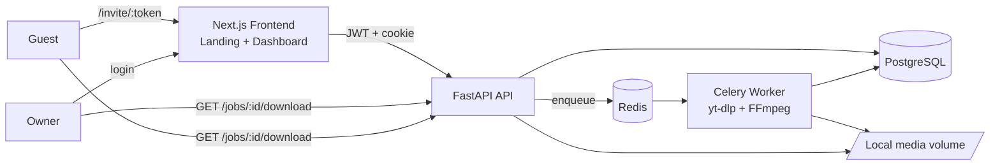
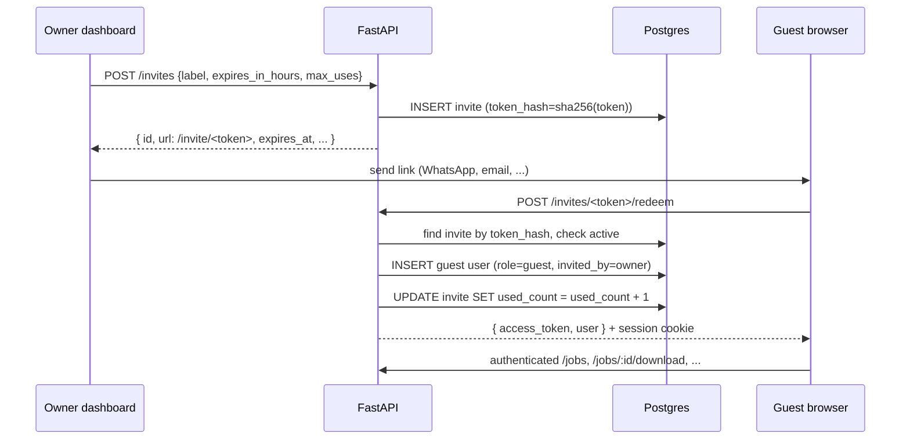
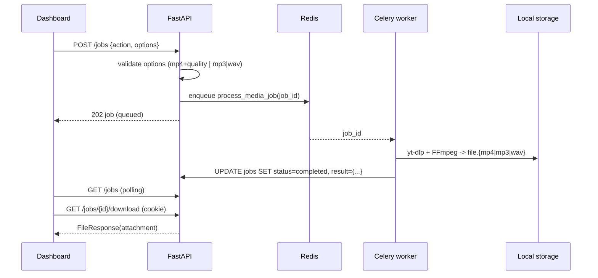

# Sonora Architecture

Sonora is a single-owner MVP focused on one feature: download a YouTube video or
audio track in a clean, authenticated and reliable way. There is no public signup —
the owner is seeded from env vars, and everyone else enters through invite links the
owner issues from the dashboard.

## Runtime topology

The worker is the only component that writes media files. The API is the only
component that reads them back out, and always through an authenticated route
(`GET /jobs/{id}/download`) that sets `Content-Disposition: attachment`.

## Services

- `frontend/`: Next.js 16 + TypeScript + TailwindCSS. One root component
  (`SonoraApp`) picks between two views:
  - `Landing`: short hero + **owner-only** login card.
  - `Dashboard`: URL input, Preview, Video/Audio selector, resolution / format
    picker, Queue button and a live-polling "Recent downloads" list with a real
    `<a download>` link to the authenticated file endpoint. If the user is the
    owner, the dashboard also renders an **Invites** panel.
  - `app/invite/[token]/page.tsx`: exchanges an invite token for a guest session,
    stores it and redirects to the dashboard.
- `backend/app/`:
  - `api/auth.py`: owner login, logout, `/me` and session cookie issuing.
  - `api/media.py`: URL validation and preview (title, thumbnail, duration, channel)
    with preview rate limiting.
  - `api/jobs.py`: create / list / get / download endpoints. Owner-checked on every
    read.
  - `api/invites.py`: create / list / revoke / redeem invite endpoints, with rate
    limiting on redemption.
  - `api/deps.py`: `get_current_user` and `require_owner` dependencies.
  - `core/config.py`: Pydantic settings including owner credentials and invite
    defaults.
  - `core/security.py`: `bcrypt` password hashing (72-byte guard), JWT utilities,
    invite token generation (`secrets.token_urlsafe(32)`) and SHA-256 hashing.
  - `core/errors.py`: RFC 7807-style problem responses.
  - `db/`: SQLAlchemy models (`User`, `MediaJob`, `Invite`) and session factory.
  - `services/bootstrap.py`: idempotent `ensure_owner_user` — creates the owner on
    first boot and rotates its hash if `OWNER_PASSWORD` changes.
  - `services/job_queue.py`: Celery app wiring.
  - `services/media_probe.py`: yt-dlp preview + supported-URL validator.
  - `services/rate_limit.py`: generic Redis-backed counter with in-memory fallback.
  - `services/storage.py`: ensures the media directory exists and allocates per-job
    UUID-named output paths.
  - `worker.py`: Celery task `process_media_job` that runs yt-dlp + FFmpeg and writes
    job result metadata back to Postgres.
- `docker-compose.yml`: local production-like runtime with `api`, `worker`,
  `postgres`, `redis` and `frontend`.

## Authentication and authorization

There are two identity kinds:

- **Owner** (`role = owner`): seeded from `OWNER_EMAIL` / `OWNER_PASSWORD`. The only
  account that can log in with a password. Can manage invites.
- **Guest** (`role = guest`): created when someone redeems an invite. Has a
  synthetic email (`guest-<hex>@guests.sonora.app`) and no password. Inherits
  `invited_by_id = owner.id`.

Auth flow:

1. Owner posts email + password to `/auth/login`, receives JWT and `sonora_session`
   cookie (HTTP-only, SameSite=Lax, `Secure` in production).
2. Guest opens `/invite/<token>`; the frontend calls `/invites/{token}/redeem`; the
   API validates the invite and creates a new guest user + JWT + cookie.
3. The frontend keeps the JWT in `localStorage` for XHR requests
   (`Authorization: Bearer`) and relies on the cookie for direct browser navigations
   like the download link.
4. `GET /jobs/{id}/download` checks the session (cookie or Bearer), verifies that the
   caller owns the job, and streams the file with `Content-Disposition: attachment`.
5. Invite management endpoints use `require_owner`, so guests get `403`.

## Invite lifecycle

Invite rules:

- Token is generated as `secrets.token_urlsafe(32)` and only its SHA-256 is stored.
- `expires_at` is clamped between 1 hour and `INVITE_MAX_TTL_HOURS`.
- `max_uses` is clamped between 1 and 100.
- An invite is **active** iff `revoked_at is null AND expires_at > now AND
  used_count < max_uses`.
- Revoking sets `revoked_at = now`; future redemptions return 404.
- Redemption is rate limited per client IP to protect against token guessing.

## Job lifecycle

### Options contract

- `action = "video_download"` → server normalizes options to
  `{ "format": "mp4", "quality": "360|480|720|1080" }`. Anything else returns 422.
- `action = "audio_download"` → server normalizes options to
  `{ "format": "mp3|wav", "bitrate": "192" }` (bitrate only for MP3). Anything else
  returns 422.

### File naming

- On disk: `{uuid4}.{ext}` inside the media volume. Avoids collisions and keeps
  titles out of filesystem paths.
- On download: the API sends `Content-Disposition: attachment` with a sanitized
  filename derived from the job title (e.g. `Never Gonna Give You Up.mp4`).

## Data model

- `users`: id, email (unique), hashed_password (nullable — guests have no password),
  full_name, role (`owner|guest`), invited_by_id (nullable FK), invite_label,
  is_active, created_at.
- `media_jobs`: id, user_id, action, status, source_url, title, progress, options
  (JSON), result (JSON), error_message, created_at, updated_at.
- `invites`: id, token_hash (sha256, unique), label, created_by_id (FK users),
  max_uses, used_count, expires_at, revoked_at, created_at.

`Base.metadata.create_all` runs on startup for MVP speed. Alembic migrations should
be added before the first shared staging environment.

## Security considerations

- Passwords hashed with `bcrypt` (pinned `<5`), limited to 72 bytes of input.
- Owner account seeded from env, promoted to owner and re-hashed on startup if the
  password changed (`ensure_owner_user`).
- Public signup is **disabled** — no `/auth/signup` endpoint exists.
- JWT signed with `JWT_SECRET`; must be rotated away from the example value before
  any deployed environment.
- Invite tokens are 32 bytes of randomness, stored as SHA-256 hashes, single-use by
  default, TTL-bounded and revocable. Redemption is rate-limited per IP.
- Cookies are HTTP-only and `Secure` in production (`SONORA_ENV=production`).
- CORS origins are read from `API_CORS_ORIGINS` and parsed into a whitelist.
- Preview endpoint is rate limited (Redis-backed) to protect yt-dlp from abuse.
- The Docker image runs the API and worker as a non-root `sonora` user.
- Generated files are never served by an anonymous static mount: every download goes
  through an authenticated, owner-checked endpoint.

## Production notes

- Replace `JWT_SECRET`, `OWNER_PASSWORD` and `POSTGRES_PASSWORD` before deploying.
- Swap the local media volume for **Cloudflare R2 or S3** and return short-lived
  signed URLs from `/jobs/{id}/download` instead of streaming from disk.
- Keep API and worker as separate containers; scale the worker pool horizontally.
- Add **Alembic** migrations before any shared environment.
- Add observability: structured logs + Sentry + a lightweight metrics endpoint.
- Optional hardening:
  - install Deno in the worker image so yt-dlp's JS extractor works for edge cases
    (today it still downloads successfully and only logs a warning);
  - add TOTP (Google Authenticator) as a second factor for the owner login;
  - migrate invite storage to a table with per-IP redemption audit trail.
